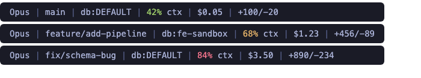

# Claude Code Context Monitor

A lightweight status line and warning system that tracks your Claude Code context window usage in real time.



## What It Does

| Component | Purpose |
|-----------|---------|
| **statusline.sh** | Displays model, git branch, context %, session cost, and lines changed at the bottom of your terminal |
| **context-monitor.sh** | PostToolUse hook that warns you once at 60% and once at 80% before auto-compaction kicks in |
| **settings.json** | Wires everything together + sets auto-compaction threshold to 80% |

### How the pieces connect

```
Claude Code (provides context % via JSON)
        │
        ▼
  statusline.sh
   ├─ renders: "Sonnet 4.6 │ main │ 42% ctx │ $1.20 │ +50/-10"
   └─ writes bridge file: ~/.claude/.context-pct-{session_id}
        │
        ▼
  context-monitor.sh (runs after every tool call)
   ├─ 60% → ⚠️  "Be concise"
   └─ 80% → 🔴 "Save state before compaction"
```

## Prerequisites

- [Claude Code](https://docs.anthropic.com/en/docs/claude-code) installed
- `jq` — `brew install jq` (macOS) or `apt install jq` (Linux)

## Install

### Option A: One-liner

```bash
bash <(curl -sL https://raw.githubusercontent.com/yogesh-dbx/claude-code-context-monitor/main/install.sh)
```

### Option B: Manual

```bash
git clone https://github.com/yogesh-dbx/claude-code-context-monitor.git
cd claude-code-context-monitor
bash install.sh
```

### Option C: Copy the files yourself

1. Copy `statusline.sh` → `~/.claude/statusline.sh`
2. Copy `hooks/context-monitor.sh` → `~/.claude/hooks/context-monitor.sh`
3. Merge `settings.json` into your `~/.claude/settings.json`
4. `chmod +x ~/.claude/statusline.sh ~/.claude/hooks/context-monitor.sh`
5. Restart Claude Code

## What You'll See

### Status line (always visible)

```
Sonnet 4.6 | main | 15% ctx | $0.14 | +0/-0
```

- Context % is color-coded: **green** < 50%, **yellow** 50–75%, **red** > 75%
- Branch shows `detached` if not on a branch

### Warnings (once per session per threshold)

At 60%:
```
⚠️  Context at 62%. Be concise — avoid verbose outputs and unnecessary file reads.
```

At 80%:
```
🔴 Context at 83%. Consider saving state before auto-compaction kicks in.
```

## Configuration

### Change warning thresholds

Edit `~/.claude/hooks/context-monitor.sh` — the thresholds are on lines 21 and 30:

```bash
if [ "$PCT" -ge 60 ] ...   # ← change 60 to your preferred first warning
if [ "$PCT" -ge 80 ] ...   # ← change 80 to your preferred second warning
```

### Change auto-compaction threshold

In `~/.claude/settings.json`:

```json
{
  "env": {
    "CLAUDE_AUTOCOMPACT_PCT_OVERRIDE": "80"
  }
}
```

### Add Databricks profile to status line

If you use Databricks, the status line can show your active profile. Set the env var:

```bash
export DATABRICKS_CONFIG_PROFILE=my-workspace
```

Then update the `echo` line in `statusline.sh`:

```bash
PROFILE="${DATABRICKS_CONFIG_PROFILE:-}"
# add to the echo:
echo -e "${MODEL} | ${BRANCH:-detached} | ${PROFILE:+db:$PROFILE | }${C}${PCT}%${R} ctx | ${COST_FMT} | +${ADDED}/-${REMOVED}"
```

## How It Works

The status line and the hook can't talk to each other directly. The bridge pattern solves this:

1. **statusline.sh** runs on every render cycle. Claude Code pipes it a JSON blob with `context_window.used_percentage`. The script extracts the percentage and writes it to a tiny file: `~/.claude/.context-pct-{session_id}`.

2. **context-monitor.sh** is a PostToolUse hook — it runs after every tool call. It reads the bridge file, checks against thresholds, and prints a warning if needed. Sentinel files (`.context-warned-60-{session}`) ensure each warning fires only once.

3. Stale bridge and sentinel files are auto-cleaned on every hook invocation (anything older than 1 day).

## Uninstall

```bash
rm ~/.claude/statusline.sh
rm ~/.claude/hooks/context-monitor.sh
```

Then remove the `statusLine`, `hooks`, and `env.CLAUDE_AUTOCOMPACT_PCT_OVERRIDE` keys from `~/.claude/settings.json`.

## License

MIT
